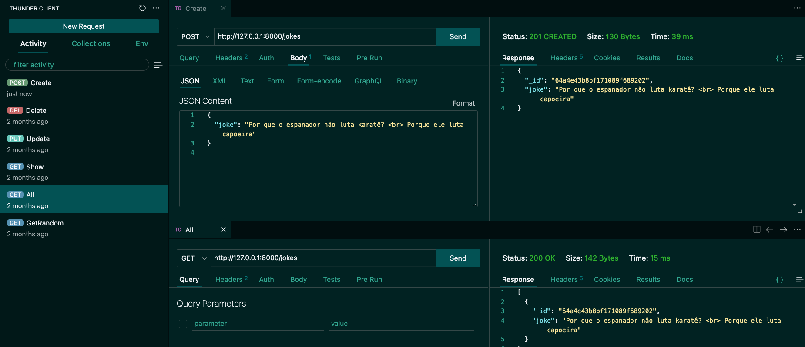

# Boas-vindas ao repositório de conteúdo API Flask

Esta Branch foi construída a partir do conteúdo de Flask na Plataforma de Aprendizagem, sendo o primeiro dia, o desenvolvimento de uma API para cadastro de piadas.

||
|:--:|
|Thunderclient acessando a Api de Piadas|
